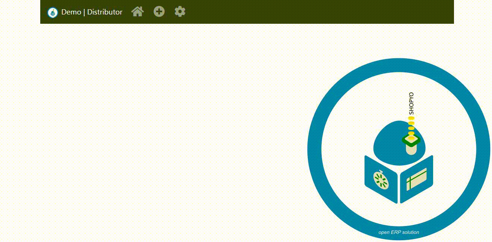

# 🔧 Install instructions

- download python3.7
- clone and cd into project
- run ```python -m pip install -r requirements.txt```

# 👟 Run instructions
run initialise.py

```python
python initialise.py
```

```python
python apply_settings.py
```

then run the app in shopyo/shopyo

```python
python app.py
```

the go to the indicated url

# :construction: Developing a template.

Each landing page and subsection should contain the following headers.


```` //  extends the base.html file.

```` // sets the active section (change section name).


#### Create the main landing page of a new section in the template folder.

Inside the template folder create a file ending ``_index.html``.


	* /template
		* /base
		* <changeme>_index.html (swap <changeme> for section name).
 

#### Create a subsection template.

Inside the template folder create a new file keeping the same section name as `` _index .html``.


	* /template	
		* /base
		* example_index.html
		* example_<changeme>.html (swap <changeme> for subsection name).

#### Create navigation elements for a new section.

Inside the template folder create a file with the same section name as ``_index.html``. Changing ``_index.html`` for ``_nav.html``.


	* /template
		* /base
		* example_index.html
		* example_<changeme>.html (swap changeme for subsection name.)
		* example_nav.html


In the  ```_nav``` .html file elements for the navigation can be created.


#### To display the navagation elements.

Open the template ``/base`` folder and locate the ``nav_base.html``.

In the ``nav_bar_log([])`` array. Enter the section name last in the list.


```python3


Now enter a new elif statement containing a reference to the _nav.html

    
      
      
    
      

     <- - - Add 1 to index.
      
```

Then the navagation elements will be displayed in the new section.

## 🍳 In Action



